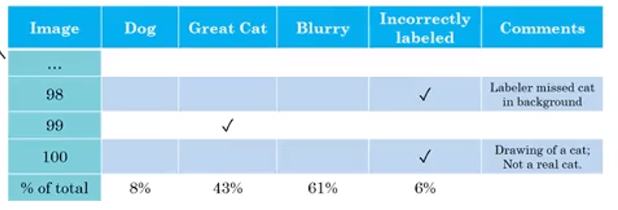

# Structuring Machine Learnig Project

## Single Number Evaluation

Positive sample が極端に少ない場合には$F_1$スコアを使って性能を測るのが優秀

## Statisificing and Optimizing Metrics

場合によっては、学習モデルを使った「実行速度」なども重要になる
例えば、精度はなるだけ高いほうが良いが「100ms 以内に」実行できること、など
その場合はコスト関数に実行速度を加えることもある

## Train/Dev/Test set

Test set と同じ比率の Dev set を使わなければ本番で良い精度で出なくてゴミになる

Dev set と Test set の特徴はなるだけ同じにしないと行けない。例えば、ユーザが投稿する写真(Test set)はボケてる写真が多いのに、Dev set でくっきり高解像度の写真を使うのはダメ

## Human level performance

- 最高の精度は 100%ではなく、ベイズエラーが現れる
- 人の精度を超えたあたりで実行時間に対して精度が上がらなくなってくる

### Avoidable bias

| Avoidable Bias  | 7%            | 0.5%              |
| --------------- | ------------- | ----------------- |
| Humans Error    | 1%            | 7.5%              |
| Traininng Error | 8%            | 8%                |
| Dev Error       | 10%           | 10%               |
| You should      | focus on bias | focus on variance |

### Improving model guiline

Human-level
↕ (Avoidable bias)
Training error
↕ (Variance)
Dev error

#### Avoidable Bias

- train longer / better optimization algorithms
  - momentum, rmsprop, adam, ...
- NN architecture / hyperparam search
  - RNN, CNN, ...

#### Variance

- More data
- Regularization
  - L2, dropout, data augumentation
- NN architecture / hyperparam search

## エラー分析

何が原因でエラー（識別間違い）になったのか、目で見て場合分けを行う。この時複数の原因が組み合わさっていることも多いため、表にした方が良い。そして、エラーの原因の多いものからやっつける。

- Incorrectly Label
  - ラベル（教師）データ自体が間違っている場合
  - 少量なら全く気にしなくていい
  - 他のエラー原因と同じようにエラーの原因として大きかったら対処する

## **Build First System Quickly, Then Iterage**

さっさとプロトを作って Bias/Variance analysis & Error analysis をやれ

## train/dev/test

これまでのまとめ

- dev と test は同じ分付を持つべき
- train と dev の精度に差があれば high variance
- train と dev の精度が近ければ high bias

本番環境(test)に近いデータが少ない場合は？

- 有象無象のデータを A, 本番に近いデータを B とすると
  - train に B の半分くらいを混ぜる
  - dev と test は B のみを使う
- この時、train と dev の精度に差がある場合、high variance なのかデータセットの不整合なのかが分かりづらい
  - train-dev を作り、train と train-dev の比較から high variance かどうかを見分けることができる
- 人工的に似たデータを作るのも一つの方法
  - ただし、あくまで生成したデータなのでエラー原因になっていないか要確認

## 転移学習

- Pre-training: 事前学習(最終的に使用するモデルとは別のモデル)
- Fine-tuning: 最終的に使用するモデルで最後の方の層だけ学習する

例えば、画像認識で 100,000,000 サンプルで事前学習したあと、放射線診断で 100 サンプルで最終学習する、など。

この場合、事前学習では画像の特徴を学習し、追加した放射線診断の層ではそれらを使って診断を学習する。ほんまか？

## マルチタスク学習

写真に写った複数の物体認識のように、出力がバイナリ識別でも、マルチクラス識別でも無く、複数あるような時に、転移学習のようにある程度の層まで共通の学習を行い、最後の方の層でそれぞれのクラスのバイナリ認識を行う。

- Rich Caruana「マルチタスク学習が、個別の NN を学習するよりも性能が低い場合は NN が十分大きくない」
  - つまり、NN が十分大きければマルチタスク学習によって性能が大幅に下ることは非常に稀

転移学習ほど使われていない

## End-to-end Learning

特徴量抽出、形態素解析、ノイズ除去などを一切行わずにすべて NN に任せる方法。クソ大量のデータがあれば前段の方法よりもいい結果が出るらしい。
