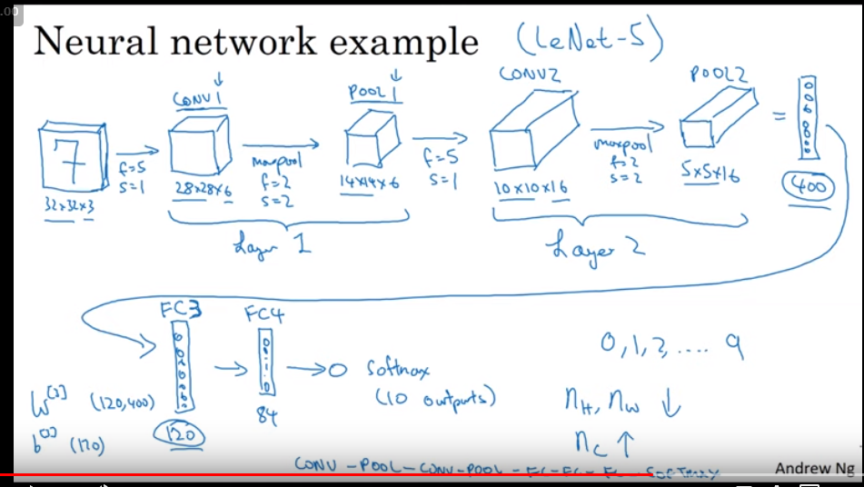
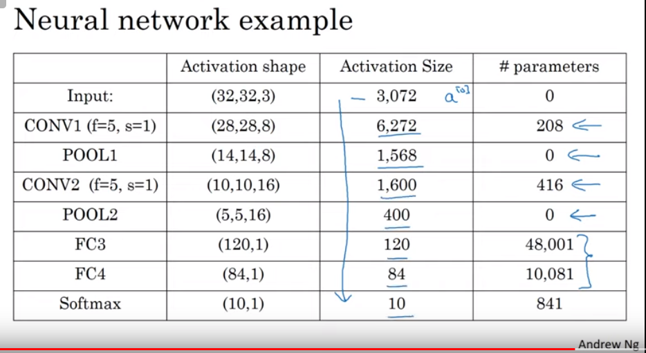

# Convolutional Neural Networks

画像は 64x64x3 の小さいサイズでも 12288 空間の特徴量になってしまう。大きい画像なんか無理。

## 畳み込み演算(filter または kernel)

```py
# 縦線検出フィルタ,  横線検出フィルタ
1, 0,-1              1, 1, 1
1, 0,-1              0, 0, 0
1, 0,-1             -1,-1,-1
```

$f^{[l]} = $ filter size
$p^{[l]} = $ padding
$s^{[l]} = $ stride
$n_c^{[l]} = $ number of filters

Each filter is: $f^{[l]} \times f^{[l]} \times n_c^{[l-1]}$
Activations: $a^{[l]} \to n_h^{[l]} \times n_w^{[l]} \times n_c^{[l]}$
Weights: $f^{[l]} \times f^{[l]} \times n_c^{[l-1]} \times n_c^{[l]}$
bias: $n_c^{[l]}$

$Input: n_h^{[l-1]} \times n_w^{[l-1]} \times n_c^{[l-1]} $
$Output: n_h^{[l]} \times n_w^{[l]} \times n_c^{[l]} $

$n_{h,w}^{[l]} = \frac{n^{[l-1]} + 2p^{[l]} - f^{[l]}}{s^{[l]}} + 1$

## 典型的な CNN の構造




## 代表的な CNN

- LeNet-5
- AlexNet
- VGG

> Andrew 先生「これらの論文の内容はかなり便利」

- ResNet (なんと 152 層)
- Inception

## LeNet

60k params

- (5x5Conv + avg pool) \* 2
- Full Connect \* 2
- softmax

Paper: _[LeCun et al., 1998. Gradient-based learning applied to document recognition]_

- 当時は activation に ReLU を使わずに tanh と sigmoid だったりするらしい
- filter が$f \times f\times nc$ではなく$f \times f \times 1$を 3 チャンネルに対して行っている。当時の計算量不足のため

## AlexNet

60M params

- ReLU
- GPU はまだ遅かったので 2 つの GPU が協調して動く特殊な作りだった
- LRN(Local Response Normalization): 後にあまり有効ではないと分かった

## VGG-16

1.3 億 params

- Paper: _very deep convolutional networks for large scale image recognition_
  - nh,nw を減らし、nc を増やす方法が体系的にまとめられている

AlexNet, VGG, LeNet の順で読むと良い？

## ResNet

- shortcut/skip

通常、深い NN は正則化や weights decay によって activation の値が小さくなっていくが、skip によって値を大きくすることで学習しやすさを快復している

## 1x1 Conv

Network in Network

## Inception Module

- 28x28x192
  - 1x1x64
  - 1x1x96
    - 3x3x128
  - 1x1x16
    - 5x5x32
  - 3x3 maxpool
    - 1x1x32

64 + 128 + 32 + 32 = 256

## Transfer Learning

学習済みモデルの最終層だけ学習し直す。
最終層以外は"Freeze"する(再学習しない)

## Data Augumentation

よく使われる

- Mirroring: 左右反転
- Random Cropping: 画像の一部を切り出す
- Color shifting: RGB に値を増減したりする

あまり使われない

- Rotation, Shearing, Local warping

Advanced:

- PCA Color Augumentation
  - AlexNet の論文に詳しく乗ってるらしい
